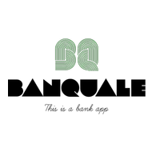

# Banquale

[](https://codefirst.iut.uca.fr/antoine.perederii/Banquale)
[](https://codefirst.iut.uca.fr/sonar/dashboard?id=Banquale)
[](https://codefirst.iut.uca.fr/sonar/dashboard?id=Banquale)
[](https://codefirst.iut.uca.fr/sonar/dashboard?id=Banquale)
[](https://codefirst.iut.uca.fr/sonar/dashboard?id=Banquale)

# Table of Content
[overview--big-picture](#overview--big-picture) | [Features](#features) | [Getting Started](#getting-started) | [Prerequisites](#prerequisites)


## Overview / Big picture
This project is a ....

## Features

## Documentation 
Doxygen 
Wiki

## Getting Started

### Prerequisites

### Installation

## Running the tests

## How to contribute ?

## What we have now ?

## Usage

## Known issues and limitations
deux blanc en fin de lignes = saut de ligne  
sdf
## Authors 

## Acknowledgments

## License 


```python
print("Bonjour, monde!")
```

SAÉ 2.01 Développement d'une application Le projet est une app mobile de Gestion Bancaire. PEREDERII Antoine, LOUVET Titouan
