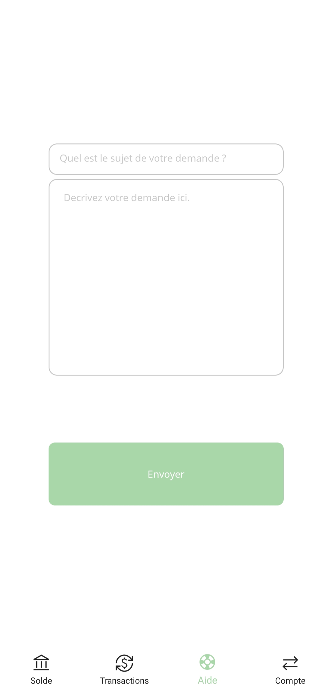
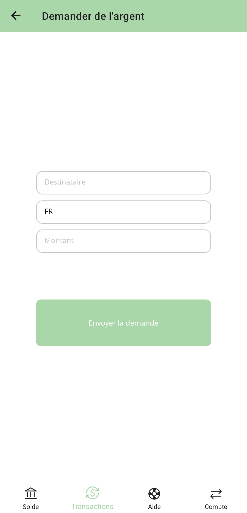

# Banquale - Android Bank App

# Table of Content
[Overview](#overview--big-picture) | [Documentation](#documentation) | [Prerequisites](#prerequisites) | [Getting Started](#getting-started) | [Features](#features) | [What we have now ?](#what-we-have-now) | [Screen Capture](#screen-capture) |[Usage](#usage)| [Built With](#built-with) | [Known issues and limitations](known_issues_and_limitations) | [Contributors](#contributors) | [How to contribute ?](#how-to-contribute) | [License](#license) | [Acknowledgments](#acknowledgments)

## Overview / Big picture
Banquale is a mobile banking application built using .NET MAUI technology for the Android platform. This application provides users with a simple and intuitive way to manage their finances, including viewing account balances, transferring money and more.

## Documentation 
Documentation and information about `Banquale` are available [here](https://codefirst.iut.uca.fr/documentation/antoine.perederii/Banquale/doxygen/index.html)

### Prerequisites
* [Visual Studio 2022](https://visualstudio.microsoft.com/fr/vs/) - IDE
* [Git](https://git-scm.com/) - Versioning
* [.NET 7.0 SDK](https://docs.microsoft.com/fr-fr/dotnet/maui/get-started/installation) - Framework
* [Android SDK](https://developer.android.com/studio) - Emulator

## Getting Started
1. Clone the repository
2. Open the **'Banquale.sln'** project in Visual Studio 2022
3. Set the startup project to Banquale.Android
4. Select the emulator you want to use or connect your phone
5. Build and run the project

## Features
* View account balances and transaction history
* Transfer money between accounts
* View and manage account

## What we have now
The application is functional but the color is not good and the design is not finished. All the C# code is not commented and the documentation is not finished.

## Screen Capture

## Usage
* The application is used to manage your bank account
* You can see your balance, your transaction history, your RIB, your accounts and you can make a transfer to another account
* You can also change account

## Built With
* [Visual Studio 2022](https://visualstudio.microsoft.com/fr/vs/) - IDE
* [CodeFirst](https://codefirst.iut.uca.fr/) - Gitea
  * [Drone](https://codefirst.iut.uca.fr/) - CI
  * [SonarQube](https://codefirst.iut.uca.fr/sonar/) - Quality
* [.NET MAUI 7.0](https://docs.microsoft.com/fr-fr/dotnet/maui/get-started/installation) - Framework
  * [C#](https://docs.microsoft.com/fr-fr/dotnet/csharp/) - Language
  * [XAML](https://docs.microsoft.com/fr-fr/dotnet/desktop-wpf/fundamentals/xaml) - Language
* [Doxygen](https://codefirst.iut.uca.fr/sonar/) - Documentation

<!-- ## Known issues and limitations -->

## Contributors
* [Antoine PEREDERII](https://codefirst.iut.uca.fr/u/antoine.perederii)
* [Titouan LOUVET](https://codefirst.iut.uca.fr/u/titouan.louvet)

## How to contribute
1. Fork it (<https://codefirst.iut.uca.fr/antoine.perederii/Banquale/fork>)
2. Create your feature branch (`git checkout -b feature/featureName`)
3. Commit your changes (`git commit -am 'Add some feature'`)
4. Push to the branch (`git push origin feature/featureName`)
5. Create a new Pull Request

## License 
This project is licensed under the MIT License - see the [LICENSE.md](LICENSE.md) file for details.

## Acknowledgments
This project was inspired by our mobile bank app, the need for a modern and user-friendly mobile banking application. Special thanks to the .NET MAUI community for their contributions and support.
